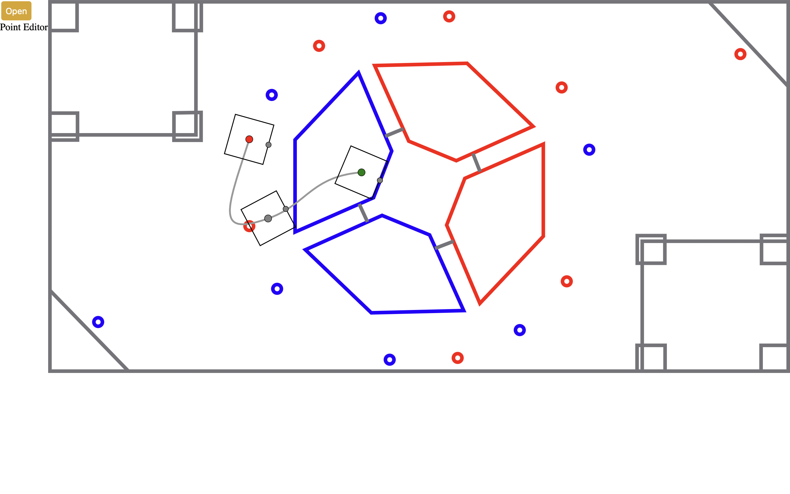

# AutoMatter

Code free autonomous generation



## Installation

1. Install [NodeJS](https://nodejs.org/en/)
2. Install [Rust](https://www.rust-lang.org/tools/install)
3. Run the following commands in the terminal

```
npm install --global yarn
yarn
```

4. Run the dev server

```
yarn tauri dev
```
